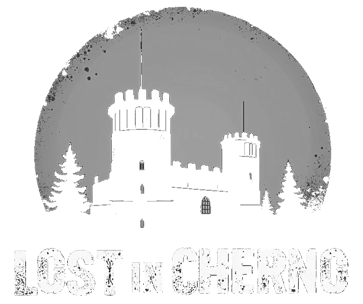

# Lost in Cherno



## A front-end prototype for a DayZ GeoGuessr

- Currently limited to ~30 locations on Chernarus
- Desktop only (you're welcome to add touch support)
- Under development until I get bored

## Development

Mainly built with react, typescript, and theme-ui

```bash
npm install
npm run dev
```

### Generating map tiles

Source image was `15161px x 15161px` (after cropping) originally downloaded via [DayZ-Map-DL](https://github.com/Samg381/DayZ-Map-DL) by Samg381.

[GDAL](https://gdal.org/) was used to generate tiles:

```bash
gdal2tiles -p raster -z 0-6 -w none --xyz input.png output_folder
```

### Compressing images

`webp` format at 90% compression seems to give best quality vs size. Use any compression you like, I used [ImageMagick](https://imagemagick.org/)

```powershell
# Convert all PNGs to WebP:
Get-ChildItem -Path . -Filter *.png -Recurse | ForEach-Object { magick convert $_.FullName -quality 90 "$($_.DirectoryName)\$($_.BaseName).webp" }
# Remove PNGs:
Get-ChildItem -Path . -Filter *.png -Recurse | Remove-Item -Force
```

### Stitching a panorma image

Screenshots taken ingame - best to use freecam mode to avoid character movements and shadows.
I used [Hugin - Panoramo editor](https://hugin.sourceforge.io/) to stitch them together.

## Credits

This project would not have been possible without the following things and more

- [DayZ](https://dayz.com/) by Bohemia Interactive
- [Satellite map](https://dayz.ginfo.gg/) by iZurvive
- [iZurvive map downloader](https://github.com/Samg381/DayZ-Map-DL) by Samg381
- [Hugin](https://hugin.sourceforge.io/) for panorama stitching
- [ImageMagick](https://imagemagick.org/) for image compression
- [GDAL](https://gdal.org/) for tile generation
- [Leaflet.js](https://leafletjs.com/) for map library
- [Suno](https://suno.com/) for generated background music
- [Flux](https://flux1ai.com/) for generated logo
